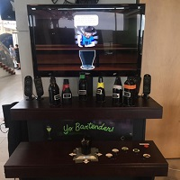
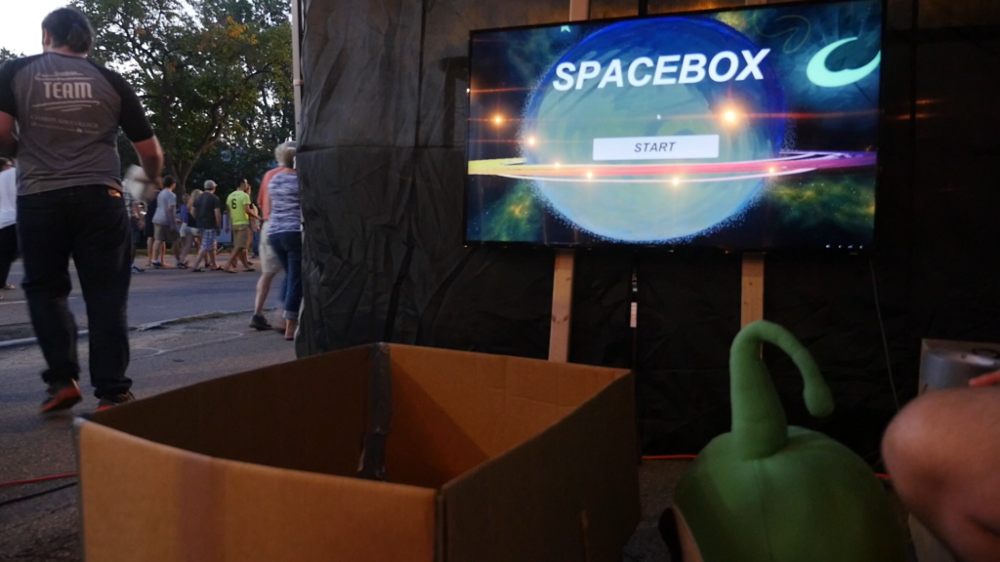
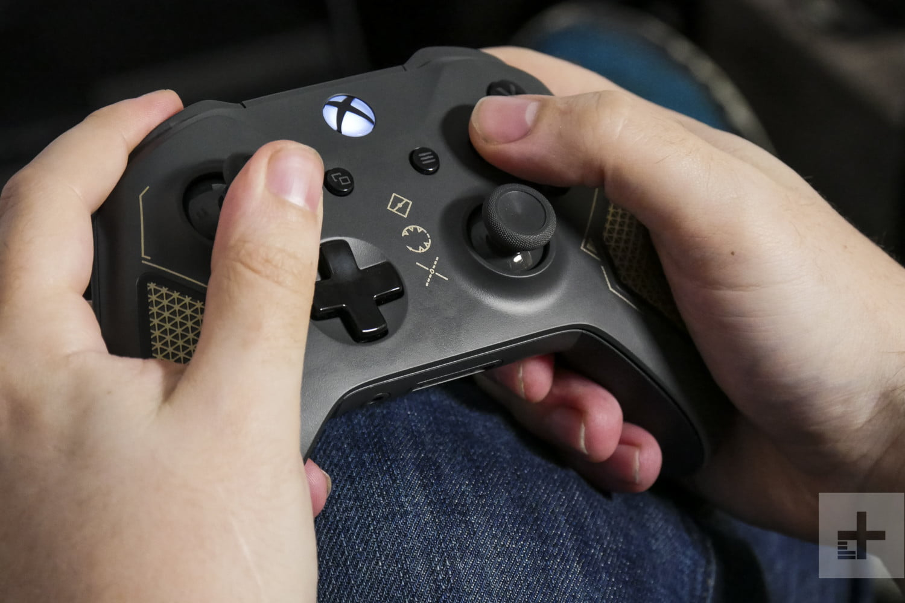
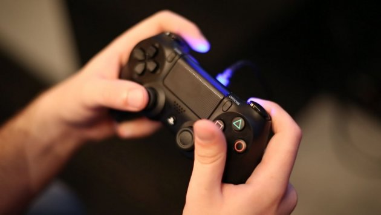
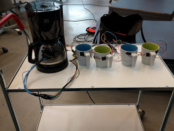
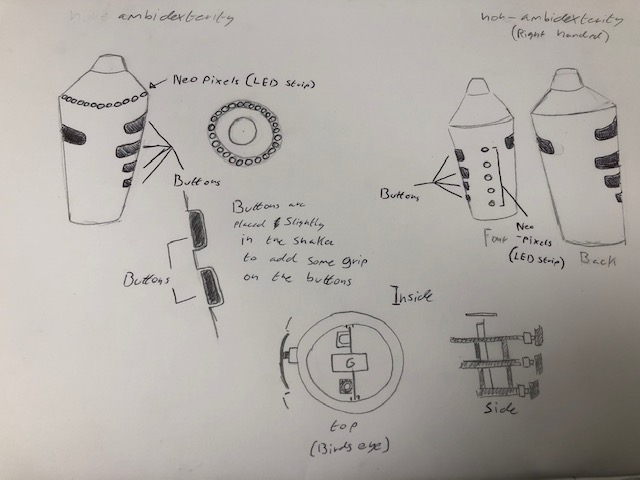

# comp140-gam160-game
Repository for Assignment 1 of COMP140-GAM160

# GAM160 Video Game Proposal

# Proposal
The game is about making cocktails by adding the right ingredients and properly shaking it to be served in a glass. The game is inspired by a game called “Yo Bartender” which also involved the player making cocktails. However, for that game you must physically pick up the bottles and the glass you pour in into is also a joystick that controls the movement of the glass so that it can be served to the customer (Burgun Keith 2018). The player will be making as many cocktails as possible within the given time. The game involves the player putting the right ingredients in the correct order. In addition, the player will need to shake the drink with the right amount of force and pour the drink into a glass. When the player shakes the cocktail bar will show how long the player needs to shake until it is done. As well as that, a meter will change from red to green depending on how much force is being used to shake the drink. This is to let the player know how much force is needed to properly shake it, the force needed to shake it will randomise per drink. The order of the ingredients will be randomised every time the player has finished making the previous cocktail. However, the game could have a list of cocktails and choose one randomly to test the player’s memory. Since the controller will only have five buttons - besides the button that opens the shaker – The bar level will only have five ingredients and the maximum number of layers will be five. When the player presses one of the buttons the bottle or object will tilt forward to pour the ingredient.
The player will need to hold the shaker under where the ingredient is being poured to catch the ingredient. The ingredients won’t be in order with the buttons so the player will have to remember which button activates the right ingredient. This is to add some form of challenge to the game. The player will need to open and close the lid otherwise the ingredients won’t go into the shaker. As well as that, if the player shakes the shaker while it is open then the drink will spill out and the player will have to start from scratch. When the player is pouring the drink, they need to hold the shaker upside down for the top to open otherwise if it’s held right side up the whole of the lid will open instead. If the player adds the wrong ingredients or puts them in the incorrect order, then the drink is poured and served the player’s time will be reduced.
The player’s score and name will be displayed on a score board along with the scores from the other players, the player with the highest score will be displayed at the top of the score board. The player’s name can be typed in via the buttons on the controller. The game will be 3D since it would require the player to lean or move around more rather than simply moving their arm if the game was in 2D. The game will be set in a bar with a beach background. The background may change depending on the type of cocktail being made, e.g. a summer cocktail would change the background to Hawaiian background. the ingredients will be placed like an arch to make the player move around. The virtual shaker will have areas which will light up depending on which button is pressed on the physical controller.
The game is meant to give off a sense of competitiveness hence why the game has the scoreboard. As stated by Keith “most competitive games have been, more or less, “symmetrical” games –games like chess or go, where each player start out with exactly the same power s at his fingertips. However, if you were designing chess, you’d still have to worry about the individual pieces being balanced. Yes, the queen is quite obviously more powerful than the rook, but the downside is that there’s only one of her”(2011). In other words, the competitive games start off with the players having the same amount of power but will become more powerful over time, but for it to remain fun for the other the more powerful tools should be more scares. This works for my game too since at the beginning each player will start off with the same power. But as players gets better at the game, they will be able to know which ingredient is which. In addition, (if the game has specific recipes) the player will know which ingredient to use next faster than newer players.

# Core Mechanics
The core mechanics of the cocktail maker game will be opening the shaker to add the different ingredients. The player will often be selecting the ingredients and trying to put them in the correct order. The player will also be closing the shaker’s lid and shaking it hard or softly enough for the right amount of time. In addition, the player will be opening and pouring the drink to a glass for it to be served.

# Bibliography
Burgun Keith. 'Understanding Balance in Video Games'. Available at: https://www.gamasutra.com/view/feature/134768/understanding_balance_in_video_.php. [Accessed Feb 7,].

COUTURE, Joel. 'Alt.Ctrl.GDC Showcase: Yo, Bartender'. Available at: /view/news/313808/AltCtrlGDC_Showcase_Yo_Bartender.php. [Accessed Feb 7,].

# GAM160 Video Game Controller Proposal

# Research
Inspiration for my controller has mainly come from the unique controllers at the alt ctrl GDC event in 2017 and 2018. One of the controllers that has inspired me is Yo bartender which is a game where the player makes cocktails depending on the customer’s order and then serves the drink to the customer using the cup like joystick. The controller allows you to physically grab and pour different bottles into a glass (Couture 2018). What I like about the game is that you can manually pour them rather than press a button. In addition, I like that you can control which direction to slide the glass so that it reaches the customer. However, (though it’s a nit-pick) I feel like the size of the controller is too big since it makes it less portable. However, the size and placement of the controls are this way to make it feel like you’re at a bar. I believe that I can use the controller’s abilities to select different drinks and move the bottles and glass for my controller. Figure 1 below is a picture of Yo Bartender.
 

Fig1: COUTURE, Joel. 2018. Yo Bartender

Another game that has inspired me is called Space Box (see figure 2) that is controlled by the player sitting in a box and tilting it to make the space ship move and direct it through space. I like it because it can allow adults to relive, and for children to experience, their imagination and the fun they had when playing (Champlain 2017). The way the controller measures the angle the player tilts to change the position of the ship and use the menu in Space Box was an inspiration for my controller. This can be used for my game so that the virtual shaker will tilt the depending on the angle of the controller and thus allow the player to pour the drink they make. As well as that, like Space Box, I hope that my game will make the player feel like they’re a part of it. What I don't like about Space Box is the fact that they could have expanded on the idea, for example they could have added buttons on the side which could control how fast you move or control different weapons and turn it into a kind of areal dog fight game.
 
 
 
Fig2: Champlain emc. 2017. Space Box

When looking at controllers for popular consoles, most of them are designed to be small so that they can be held by two or one hand with ease (see figures 3 and 4). I intend to make my controller like this as well so that it can be held easily and comfortably. In addition, making the controller small can make it commercially viable.    

 

Fig3: Gurwin, Gabe. 2019. Xbox Controller   Fig4: Honorof marshal. 2017. PS4 Controller

On shake that button I found an interesting game called Overbrewed where you physically make cups of coffee for customers, this is shown in figure 5. You get more points depending on how long you make your customers wait before they leave (Larsen Dyhr Rasmus 2016). What I like about the game and What I believe I could use for my controller is the ability to physically move around to create things that can affect the game. What I don’t like about the game is that you can like Yo Bartender you can’t control much of the game, only how well brewed the coffee is. 

Fig5: Larsen Dyhr, Ramsum. 2017. Overbrewed

# Control Description
The controller will be a converted cocktail shaker and will consist of up to seven input devices. Six being buttons which are covered by pieces of the shaker and the seventh being a gyroscope/accelerometer module (BerryIMU). The controller could potentially have an output which would be a strip of LEDs (Neopixels). The area where the Neopixels could be placed depends on whether the controller will be ambidextrous or specifically right handed. If it’s meant to only be held by the player’s right hand, then the Neopixel could be placed on the side of the shaker from bottom to top. Otherwise if the controller is created to be ambidextrous then the Neopixels could be placed around the lid of the shaker. The number of lit LEDs will depend on how many layers of the drink have been added. One of the buttons will open and close the lid of the shaker and the other five will be for the player’s left or right fingers. The buttons will be on the side of the shaker where the player’s finger tips will be. This is so that the player can hold onto the shaker normally. However, the button that opens the lid will be next to the thumb or on top of the shaker. The controller is meant to be held by one hand, mainly to make the player feel like they are a bar tender. The BerryIMU will be inside of the shaker and will be able to measure its angle, position and speed, allowing the player to shake the cocktail. The design sketch for my controller is shown below in figure 6. Though not shown in the design below the bottom of the controller will have a hole where the player will be able to connect it to the computer

# Design
 
 
 
Fig6: Oates, Max. 2019. Controller Design

At the bottomer right of the design is a ruff sketch of the inside of the controller. The shaker will house a 3D printed frame that can contain the Neopixels, buttons, Arduinos and BerryImu.

# Bibliography
Champlain emc. Space Box – The Emergent Media Centre’s 10 year anniver-sary. WordPress.

COUTURE, Joel. 2018. 'Alt.Ctrl.GDC Showcase: Yo, Bartender'. Available at: /view/news/313808/AltCtrlGDC_Showcase_Yo_Bartender.php. [Accessed Feb 7,].

Larsen Dyhr Rasmus. 2016a. 'Overbrewed – Shake that Button'. Word Press [Online]. Available at: https://shakethatbutton.com/overbrewed/. [Accessed Feb 14,].

# List of Figures

Fig1: COUTURE, Joel. 2018. Yo Bartender [Online Image] Available at: 
https://www.gamasutra.com/view/news/313808/AltCtrlGDC_Showcase_Yo_Bartender.php

Fig2: Champlain, emc. 2017. Space Box [Online Image] Available at:
http://ten.emergentmediacenter.com/2016/12/02/space-box/

Fig3: Gurwin, Gabe. 2019. Xbox Controller [Online Image] Available at:
https://www.digitaltrends.com/gaming/xbox-one-controller-battery-life-tips/

Fig4: Honorof, Marshal. 2017. PS4 Controller [Online Image] Available at:
https://www.tomsguide.com/us/connect-ps4-controller-pc,news-17952.html

Fig5: Larsen, Dyhr, Rasmus. 2016. Overbrewed [Online Image] Available at:
https://shakethatbutton.com/overbrewed/

Fig6: Oates, Max. 2019. Video Game Controller
